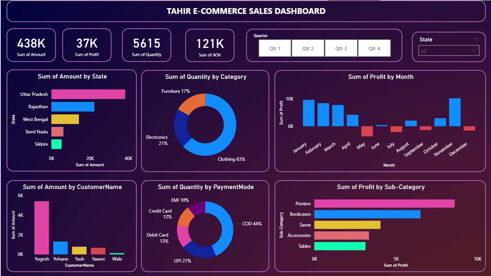
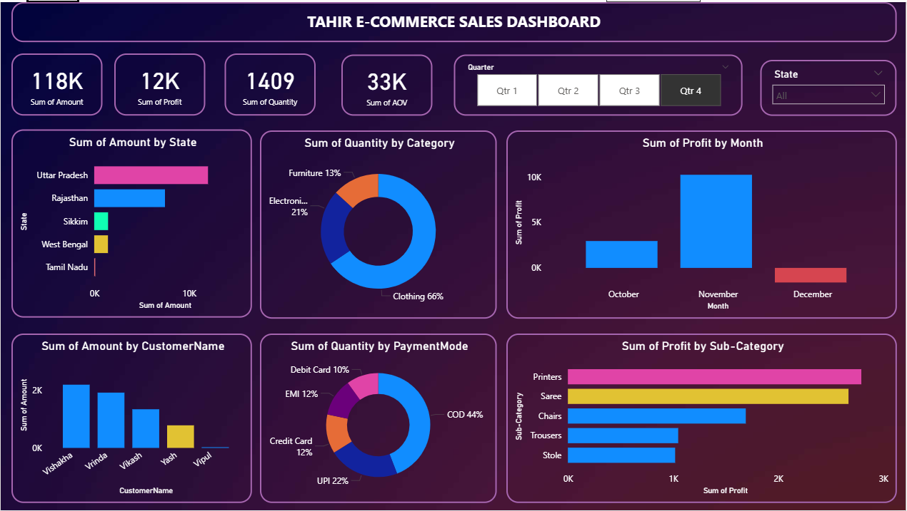

# E-Commerce Sales Dashboard

## 📌 Project Overview
This Power BI dashboard analyzes e-commerce sales data to uncover insights related to revenue, profit, customer behavior, and product performance. It helps business stakeholders track performance and make data-driven decisions.

---

## 🎯 Business Objectives
- Monitor overall sales and profit trends
- Identify top-performing products and categories
- Analyze customer purchasing behavior
- Track regional sales performance

---

## 📊 Key KPIs
- Total Sales
- Total Profit
- Number of Orders
- Average Order Value (AOV)
- Sales by Category
- Sales by Region

---

## 🛠 Tools & Skills Used
- Power BI
- DAX
- Data Modeling
- Business Intelligence
- Data Visualization

---

## 📂 Project Files
- **Power BI File:** `TAHIR E-COMMERCE SALES DASHBOARD.pbix`
- **Software Required:** Power BI Desktop

---

## 📸 Dashboard Preview

---

## 👤 Author
**Mohammed Tahir**
