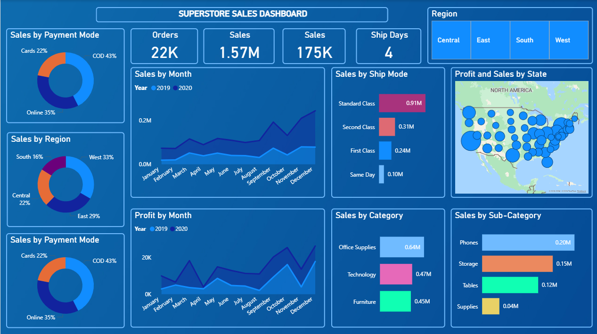
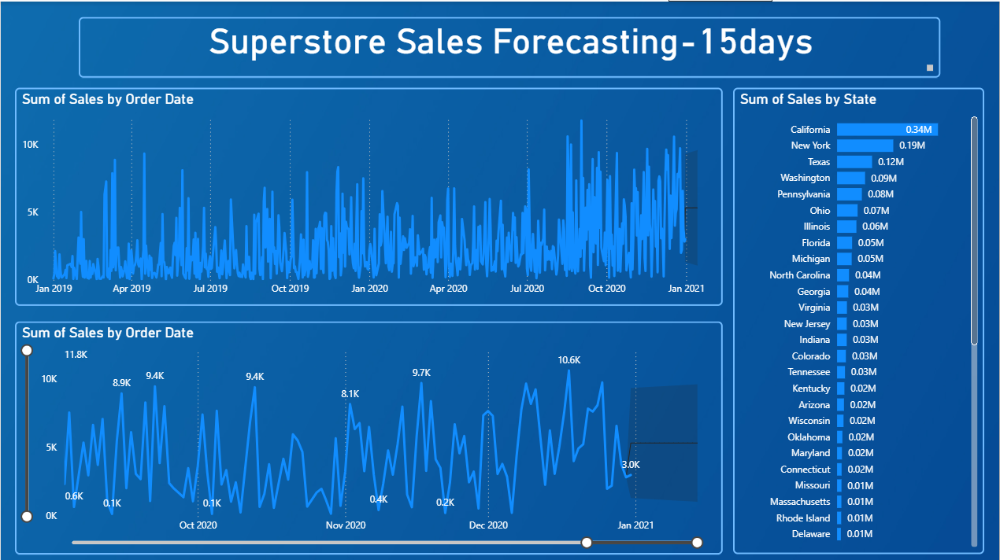

# Superstore Sales Performance & 15-Day Forecasting Dashboard (Power BI)

## Executive Summary
This Power BI solution provides a consolidated view of Superstore sales performance with an added short-term (15-day) sales forecast to support operational and tactical decision-making. It enables leadership to track revenue, profitability, order behaviour, and logistics efficiency while anticipating near-term demand trends.

---

## Business Objectives
- Monitor overall sales, profit, and order volume across regions and states  
- Identify high-performing and underperforming geographies, categories, and sub-categories  
- Analyse customer purchasing behaviour through payment and shipping modes  
- Track logistics efficiency using average shipping days  
- Forecast short-term sales to support inventory planning and operational readiness  

---

## Key KPIs & Metrics
- **Total Orders:** 22K  
- **Total Sales:** 1.57M  
- **Total Profit:** 175K  
- **Average Ship Days:** 4  
- **Sales by Month (YoY):** 2019 vs 2020 trend comparison  
- **Sales by Category:** Office Supplies, Technology, Furniture  
- **Sales by Sub-Category:** Phones, Storage, Tables, Supplies  
- **Sales by State & Region:** State-wise ranking and regional contribution  
- **15-Day Sales Forecast:** Time-series based forward-looking projection  

---

## Dashboard Features & Insights
- **Executive KPI Strip:** Instant snapshot of business health (Orders, Sales, Profit, Ship Days).  
- **Time-Series Analysis:** Daily and monthly sales trends highlighting volatility, seasonality, and growth momentum.  
- **Sales Forecasting:** Built-in Power BI forecasting to project the next 15 days of sales, supporting short-term planning.  
- **Geographical Performance:**  
  - State-level sales ranking (California and New York as top contributors).  
  - Geo-map visual correlating sales volume and profit distribution across the US.  
- **Customer Behaviour Analysis:**  
  - Payment Mode split (COD, Online, Cards) revealing preference patterns.  
  - Shipping Mode analysis showing dominance of Standard Class and its revenue impact.  
- **Product Performance:**  
  - Category and sub-category contribution analysis to identify revenue drivers and margin opportunities.  
- **YoY Comparison:** Clear contrast between 2019 and 2020 trends for both sales and profit, supporting growth evaluation.  

---

## Dashboard Preview

---

## Data Model & Technical Approach
- **Star Schema Design**
  - **Fact Table:** Orders (Sales, Profit, Quantity, Order Date, Ship Date)  
  - **Dimension Tables:** Date, Product (Category, Sub-Category), Customer, Geography (State, Region), Ship Mode  
- **Relationships**
  - One-to-many relationships from dimensions to the sales fact table  
  - Date table used for accurate time intelligence and forecasting  
- **DAX Measures**
  - Total Sales, Total Profit, Total Orders  
  - Average Ship Days  
  - YoY Sales and Profit comparison  
  - Forecast-enabled measures using Power BI analytics pane  
- **Performance Considerations**
  - Aggregated measures over calculated columns  
  - Clean separation of dimensions to support scalable analysis  

---

## Tools & Skills Demonstrated
- Power BI Desktop  
- DAX (Measures, Time Intelligence)  
- Data Modelling (Star Schema)  
- Sales Forecasting & Trend Analysis  
- Business Intelligence & Data Visualisation  
- Analytical Storytelling for Stakeholders  

---

## Real-World Use Case / Business Impact
- **Sales Leadership:** Identify revenue-driving regions and optimise territory focus.  
- **Operations & Supply Chain:** Use 15-day forecasts to plan inventory and shipping capacity.  
- **Management:** Track profitability trends and assess year-over-year business growth.  
- **Strategy Teams:** Understand customer preferences across payment and delivery modes to refine go-to-market strategies.  

---

## How to Use the Dashboard
1. Open the `.pbix` file in Power BI Desktop.  
2. Use **Region**, **State**, and **Date** slicers to focus analysis.  
3. Interact with visuals to drill into categories, sub-categories, and shipping modes.  
4. Review the forecasting section to understand short-term sales expectations.  
5. Hover over charts and maps for detailed tooltips and contextual insights.  

---

## Portfolio Value (Why This Project Stands Out)
- Combines **descriptive, diagnostic, and predictive analytics** in a single solution.  
- Demonstrates clear **business thinking**, not just visual design.  
- Shows ability to translate raw transactional data into **actionable insights**.  
- Forecasting component highlights readiness for **real-world, decision-driven BI roles**.  
- Clean layout and KPI-driven storytelling aligned with recruiter and stakeholder expectations.  

---

## Author
**Mohammed Tahir**
